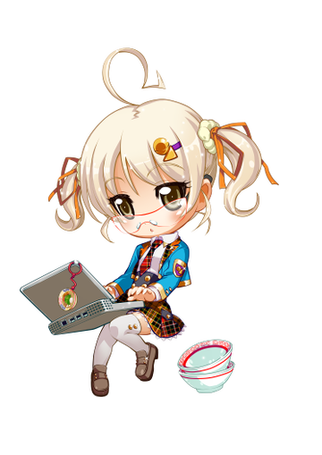
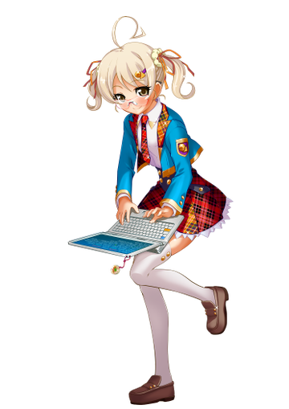

======================
アルティネット　ねつこ
======================

**ねつこ (Netsuko)** は `株式会社アルティネット <http://www.ultinet.co.jp/>`_ の公式マスコットです。

See one of:

- `WHOAMI <docs/ja/WHOAMI.ja.rst>`_ - キャラクター設定
- `ガイドライン <docs/ja/GUIDELINES.ja.rst>`_ - 利用ガイドライン

----

.. image:: http://i.creativecommons.org/l/by-nc-sa/4.0/88x31.png
   :target: http://creativecommons.org/licenses/by-nc-sa/4.0/

ねつこは https://github.com/ultinet/netsuko で管理・更新されています。

ライセンスは `Creative Commons Attribution-NonCommercial-ShareAlike 4.0 International License. <http://creativecommons.org/licenses/by-nc-sa/4.0/>`_
が適用されます。

ライセンスについての詳細は `ガイドラインのライセンス項 <docs/ja/GUIDELINES.ja.rst#ライセンス>`_ をご覧ください。

.. image:: http://www.ultinet.co.jp/img/ultinet_logo4b.jpg
   :target: http://www.ultinet.co.jp/

Copyright © 2014 Ultinet, Inc. All Rights Reserved.
